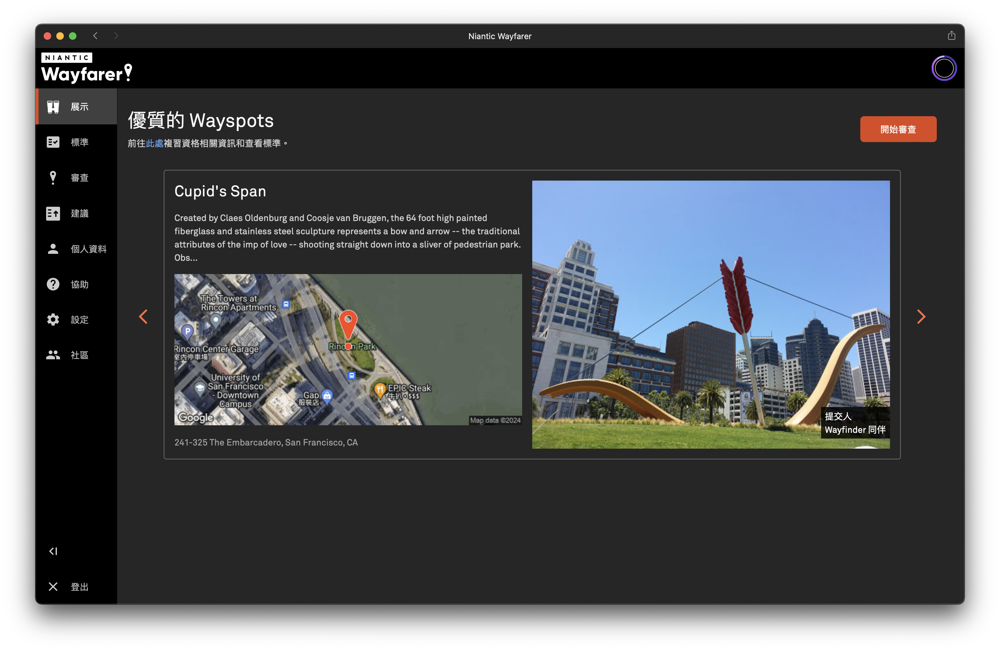
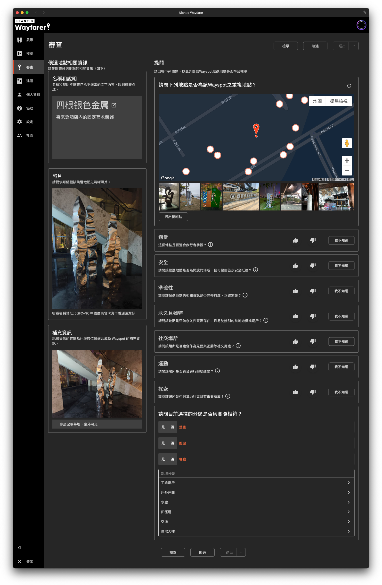

# Niantic Wayfarer

> 本文来自[神奇宝贝百科](https://wiki.52poke.com/index.php?title=Niantic_Wayfarer&oldid=2332213)，并根据本维基的主题进行适当修改。
> 
> 本文基于[署名-非商业性使用-相同方式共享 3.0](http://creativecommons.org/licenses/by-nc-sa/3.0/deed.zh-hans)许可协议。

**Niantic Wayfarer**（简称Wayfarer）是Niantic的一款面向其旗下游戏玩家社群的地图制图平台，它包含一个网页应用，以及内置于Ingress等Niantic部分游戏中的申请功能。符合申请资格的Pokémon GO训练家可以在游戏中提交新Wayspot的'''候选建议'''和既有Wayspot的'''编辑建议'''，并在Wayfarer网页应用中管理这些建议；符合审核资格的用户则可以在Wayfarer网页应用中审核他人提交的新Wayspot建议以及所有人提交的编辑建议。建议经过用户审核后，Wayfarer系统最终会根据这些审核结论进行批准或拒绝。被接受的建议将会加入Niantic的数据库，并根据一定的条件选择性地加入各个游戏的数据库中。

## Wayspot

**Wayspot**是Wayfarer中对[兴趣点](http://zh.wikipedia.org/wiki/兴趣点)的称谓，是现实中各种独特而含有意义的地点，也是整个Wayfarer平台乃至Niantic的核心资产，其雏形是Ingress中的能量塔。

## 历史

### 内部审核时期

Ingress上线后，其玩家可以在游戏中提交新能量塔的申请。此时提出的申请均由Niantic工作人员审核以决定是否在游戏中上线。随着玩家数量不断增长并且能量塔是游戏玩法的核心，其申请数量也快速增长并且开始积压，Niantic于2015年5月关闭了能量塔申请功能，但已提交的申请仍在由工作人员审核，此时积压的申请获得审查直至得出结果往往需要较长时间，有的甚至达到数年之久。

### Operation Portal Recon平台时期

为了消化积压的能量塔申请，并将整个流程变得更加可持续，Niantic于2017年5月11日开放了经过半年内部测试的**Operation Portal Recon**（简称*OPR*）平台供符合资质的Ingress探员审查过往积压的能量塔申请[^operation-portal-recon-available]。

[^operation-portal-recon-available]: [Operation Portal Recon Out Of Beta! | Fev Games](https://fevgames.net/operation-portal-recon-available/)

OPR平台是一个相对简陋的网页应用，其整体设计符合Ingress游戏以及Ingress情报地图的黑客风格，亦使用了Ingress中的专有名词。

### Niantic Wayfarer时期

2019年10月10日，Niantic上线了**Niantic Wayfarer**平台以取代OPR平台，Ingress专有的能量塔的概念被扩展为与具体游戏无关的“Wayspot”。同年11月13日，Niantic向40级的Pokémon GO训练家开放了Wayfarer平台以及寶可補給站及道館提名功能[^communitynote-niantic-wayfarer-launch]。

[^communitynote-niantic-wayfarer-launch]: [Community Note：訓練家等級40級的訓練家可以使用Niantic Wayfarer、寶可補給站及道館提名功能了！ - Pokémon GO](https://www.pokemongolive.com/zh_hant/post/communitynote-niantic-wayfarer-launch/)

## 使用资格

满足以下条件之一的用户能够在游戏中提交Wayspot候选建议和编辑建议，并在网页应用中管理建议：

- Ingress Prime中等级8以上的探员
- Pokémon GO中等级37以上的训练家

在满足上述条件的基础上，满足以下条件的用户还能够在网页应用中审核已提交的的Wayspot候选建议和编辑建议：

- 通过Wayfarer的测验

## 网页应用

Niantic Wayfarer网页应用需要登录Niantic账号才能使用。应用为两栏布局，用户可以通过左侧边栏的按钮前往各个功能页面。

### 展示

**展示**（日文︰**ショーケース**，英文︰**Showcase**）页面中会展示一些优质的Wayspot。系统通常会基于用户近期在游戏中的位置推送一些新增的优质Wayspot，如果没有合适的候选，则会显示两个默认Wayspot：
* Cupid's Span（丘比特的弓箭）：位于美国旧金山里肯公园的雕塑。
* 蜘蛛のブロンズ像（蜘蛛铜像）：位于日本东京六本木森大厦旁的雕塑，正式名称为[妈妈](http://zh.wikipedia.org/wiki/妈妈_(雕塑))。

对于在设定中开启了“在Wayspot提交頁面上顯示的代碼”选项的提交者，其Wayspot图片右下角会显示提交者的用户名，未开启的则显示为“Wayfinder同伴”。

另外，正在举办的挑战活动和用户获得升级的通知也会以横幅的形式显示在此页面的顶部。

### 標準

**標準**（日文︰**基準**，英文︰**Criteria**）页面罗列了Wayspot的资格标准、审查的标准、审查时拒绝的标准以及一些硬性的内容准则，并辅以一些图片和文字示例进行说明。

### 審查

**審查**（日文︰**審査**，英文︰**Review**）页面供符合资格的用户对其他用户提出的申请进行审核。针对候选建议、编辑建议以及新增照片三类申请，分别有不同的流程和界面。系统会根据[設定](#設定)中的家乡位置和额外位置向用户推送申请，有时也会推送同一地区（通常是国家）内较偏僻位置的申请；在举办[挑战活动](#活动)的期间，系统还会向参与者推送活动地区的申请。

**候选建议的审查流程**

- 系统不会向用户推送自己的候选建议
- 检查标题、说明、補充資訊、位置以及是否于已有Wayspot重复
  - 如果位置不正确，用户可以提出新地點，
  - 如果标记为重复则将结束当前建议的审查并提交结论，其会在Agreement中被计为“重複”
- 根据标准评价其是否'''適當'''、是否'''安全'''、'''準確性'''如何以及是否'''永久且獨特'''，有任一项目评价为否定则会在确认后立即结束当前建议的审查并提交结论，其会在Agreement中被计为“否決”
  - 其中“适当”和“准确性”评价为否定时，用户还需要在对话框中选择原因
- 评价其是否為'''社交場所'''、是否適合'''運動'''以及是否適合'''探索'''，这三个项目评价为否定不会导致建议被视为否决
- 选择分类
  - 如果系统给出了'''目前選擇的分類'''，则必须为它们分别选择“是”或“否”
  - 如果系统没有给出目前選擇的分類，则可以不选择分类
- 提交结论，其会在Agreement中被计为“批准”

**编辑建议的审查流程**

- 系统可能向用户推送自己的编辑建议
- 同一个Wayspot的标题、描述和位置的多次修改会被合并审查
- 用户需要从候选的标题、描述和位置中选择最合适/正确的一个或“以上皆非”/“找不到適當的地點”

**新增照片的审查流程**

- 用户需要从列出的照片中选择不符合标准的照片，或选择“全部符合”

每份建议从第一次推送开始有大约20分钟的审查时限，这个时限不会因为页面关闭而延长，过期后网页会提示审查截止，并推送下一份建议。

### 建議

**建議**（日文︰**投稿**，英文︰**Contributions**）页面是一个候选建议管理器，用户可以在此处浏览、搜索和筛选自己提出的候选建议，查看其内容和状态。用户还可以暂停或取消没有得出结果的申请，对**待审查**的申请进行修改，以及对被否决的申请提出申诉。

### 個人資料

**個人資料**（日文︰**プロフィール**，英文︰**Profile**）页面中展示用户的[Wayfinder评价](#Wayfinder评价)、审查的总数、[Agreement](#升级)的数量以及[升级](#升级)的进度和数量。

### 協助

**協助**（日文︰**ヘルプ**，英文︰**Help**）页面包含对Wayfarer网页应用的详细介绍和完整的审查标准。

### 設定

**設定**（日文︰**設定**，英文︰**Settings**）页面包含以下设置选项：

- 语言
- 界面的深色模式
- 是否在其他用户的[展示页面](#展示)上展示自己的用户名
- 審查頁面的自動捲動功能
- 家鄉位置（通常情況下僅能更改一次）
- 額外位置（通常情況下每年僅能更改一次）
- 是否自動套用[升級](#升級)點數
- 是否參與[挑战活动](#活动)

## 基本机制

### 申请与审核的标准

虽然Niantic为适合作为Wayspot的物体类型、申请的具体内容等制定了标准和参考案例，也指出了常见的需要拒绝的情形，但事实上标准本身即存在大量模糊不清甚至完全主观的条例（如“與他人交流的好地方”之“喜歡的咖啡廳”），因而审核者往往需要根据主观感受进行评价。此外，部分地区的审核群体也可能形成一些约定俗成的共识，但这些共识在不同地区甚至不同游戏的审核群体间可能存在非常大的差异，例如日本地区的审核者可能较为接受社区的布告栏，但在中国大陆地区这类申请往往难以获得批准。

可能被大部分审核者接受的Wayspot候选包括（但不限于）：

- 机场、火车站、客运港口等大型交通枢纽
- 大学、图书馆、博物馆、有明确标识的公园、运动场、儿童游乐城堡等文化体育设施
- 并非量产的大型雕像、雕塑、雕刻、装饰喷泉等
- 有明确标识的历史建筑、人文景点
- 对于台湾地区：彩绘变电箱
- 对于中国大陆地区：石狮子、中国邮政、凉亭和健身器材群

可能被大部分审核者拒绝的Wayspot候选包括（但不限于）：

- 警察局、消防局、设有急诊的医院等提供紧急服务的场所
- 幼儿园、小学、中学等并非提供[高等教育](http://zh.wikipedia.org/wiki/高等教育)的教育场所（或所谓[K-12](http://zh.wikipedia.org/wiki/K-12)教育场所）
- 政府禁区、军事基地等明显受到通行限制的场所
- 量产且大量重复的物件
- 明显属于临时性的物件

### Agreement

**Agreement**指用户对某个候选建议作出的结论（即“批准”、“否决”和“重复”）与其经过社区审核后得出的结果一致。Agreement的计数会显示在[個人資料](#個人資料)页面。每累积100次Agreement就会获得一次[升級](#升級)点数，此外Agreement也可能影响[Wayfinder评价](#Wayfinder评价)，但Niantic并未公布具体的机制。

### Wayfinder评价

**Wayfinder评价**是Wayfarer对用户的一种较为模糊的等级评价，从低到高分为**不佳**、**一般**、**良好**和**优良**四个等级。Niantic并未公开评价的具体方式，仅指出较高的Agreement数量能够提升评价以及滥用行为会降低评价。

在OPR时期，Niantic对用户的评价分为**Poor**、**Good**和**Great**三级。

### 升級

**升級**是一种能让用户指定的候选建议更快地被审核的机制，通常能让候选建议更快地进入审核状态并得出结果，但Niantic并不对时限作出保证。用户的[Agreement](#Agreement)每增加100就会获得一枚升级点数。如果用户开启了自动兑换，系统会自动随机升级一个未得出结果的建议或在收到新的申请时自动升级，如果关闭了自动兑换，则用户可以在[建議](#建議)页面手动选择升级未得出结果的建议。

## 活动

Niantic会不定期地举办面向审核的挑战活动，其形式通常如下：

- 选定一个或多个地区，系统在规定的时间内向参与活动的用户随机推送这些地区的Wayspot候选
- 活动设有社区目标和个人目标，通常是解决的Wayspot数量（社区）和审核的Wayspot数量（个人），并分别分为多个层级
- 随着挑战活动的进行，Niantic可能宣布增加新的地区
- 活动结束后，参与用户会在根据达到的目标层级获得对应的奖励，通常为游戏中道具的兑换码（社区/个人）和若干次的升级（个人），其中兑换码以电子邮件的形式发出

## 用户社区

### 社区论坛

可以点按网页应用左侧边栏的**社區**（日文︰**コミュニティ**，英文︰**Community**）按钮进入社区论坛。

## 外部链接

* [Niantic Wayfarer 网页应用](https://wayfarer.nianticlabs.com)
* [Niantic Wayfarer 官方社区论坛](https://community.wayfarer.nianticlabs.com)
